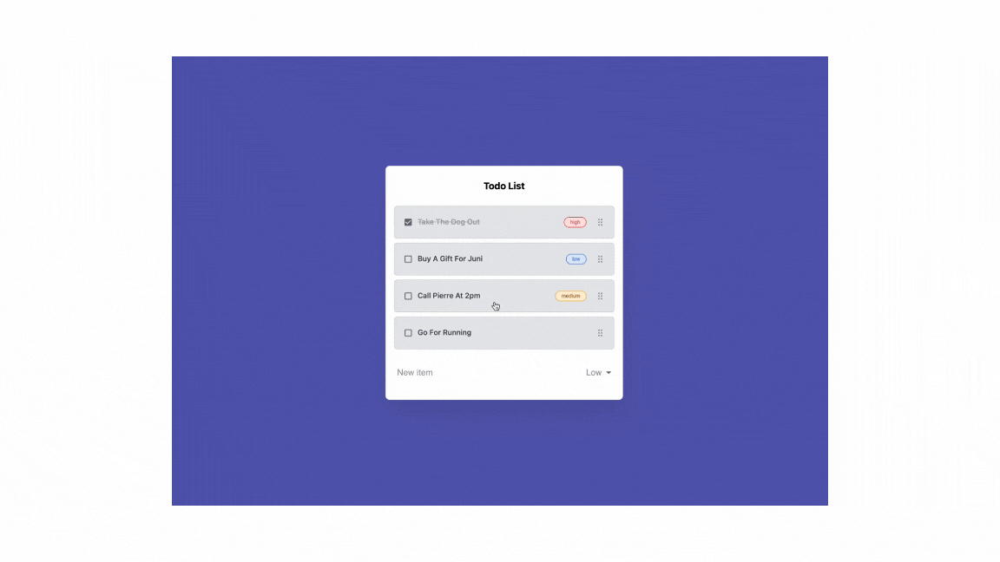

# React Drag-and-Drop Todo List

A simple and elegant **React Todo List** application that allows users to manage their tasks with drag-and-drop functionality. The application showcases the power of React for building dynamic user interfaces and offers an intuitive experience for task management.

---

## 🚀 Features

- **Add Tasks**: Easily add new tasks to your todo list.
- **Delete Tasks**: Remove tasks you no longer need.
- **Drag-and-Drop**: Reorder tasks seamlessly with a drag-and-drop interface.
- **Responsive Design**: Optimized for both desktop and mobile screens.
- **Dynamic State Management**: Fully functional state management using React's state hooks.

---

## 📸 Demo

### Reordering Tasks with Drag-and-Drop:

<!--  -->



---

## 🛠️ Installation

To run this project locally, follow these steps:

1. **Clone the Repository**:

   ```bash
   git clone https://github.com/your-username/react-drag-drop-todo.git
   cd react-drag-drop-todo
   ```

2. **Install Dependencies**:
   Make sure you have [Node.js](https://nodejs.org/) installed. Then, run:

   ```bash
   npm install
   ```

3. **Start the Application**:
   Start the development server with:
   ```bash
   npm start
   ```
   Open [http://localhost:3000](http://localhost:3000) in your browser to view the app.

---

## 🔅 Usage

1. **Add a Task**:
   - Enter a task in the input field and click the "Add" button.
2. **Reorder Tasks**:
   - Drag a task item to reorder it within the list.
3. **Delete a Task**:
   - Click the delete icon to remove a task from the list.

---

## 👨‍💻 Technologies Used

- **React**: Front-end library for building user interfaces.
- **TypeScript** (Optional): For type-safe development (if applicable).
- **CSS**: Styling for responsive design and drag-and-drop elements.

---

## 💁‍♂️ Project Structure

```
react-drag-drop-todo/
├── public/
├── src/
│   ├── components/        # Reusable components
│   ├── hooks/             # Custom hooks (e.g., drag-and-drop logic)
│   ├── App.tsx             # Main app component
│   └── main.tsx          # React entry point
├── package.json
└── README.md              # Project documentation
```

---

## 🙋‍♂️ Questions?

If you have any questions, feel free to open an issue or contact me directly:

- GitHub: https://github.com/basnetrohit47
- Email: basnetrohit47@gmail.com
